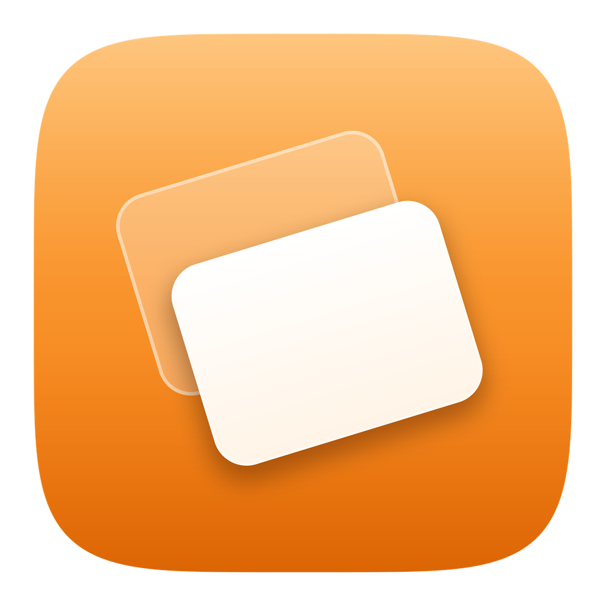

<div align="center">



# Hydra Display

**Create virtual displays on macOS — open source, Liquid Glass, no Developer ID required.**

A free, native alternative to BetterDisplay focused on one thing done well:
spinning up virtual (HiDPI/Retina) displays in a couple of clicks.
Built 100% natively for **macOS 26 (Tahoe)** with a SwiftUI **Liquid Glass** interface.

[](https://www.apple.com/macos/)
[](https://swift.org)
[](https://developer.apple.com/design/)
[](LICENSE)
[](CONTRIBUTING.md)

</div>

---

## Table of contents

- [Features](#features)
- [Screenshots](#screenshots)
- [Requirements](#requirements)
- [Installation](#installation)
- [Build from source](#build-from-source)
- [Usage](#usage)
- [How it works](#how-it-works)
- [Project structure](#project-structure)
- [Roadmap](#roadmap)
- [Contributing](#contributing)
- [Security & private API](#security--private-api)
- [License](#license)
- [Credits](#credits)

## Features

- **Create & remove virtual displays** with a name, HiDPI/Retina toggle, and one or more advertised resolutions.
- **Resolution presets** — 16:9, 16:10, ultrawide and portrait sets, plus add-your-own custom modes.
- **Menu bar item** — one-tap *4K Retina / 1440p / 1080p* quick displays and instant removal, without opening the main window.
- **Mirror & arrangement** — drag displays to rearrange the desktop space and mirror any screen onto another (works for real *and* virtual displays).
- **Native Liquid Glass UI** — a content/material layer for information and a single floating glass layer for controls, following Apple's macOS Tahoe guidance.
- **No account, no Developer ID** — builds and runs with ad-hoc *Sign to Run Locally* signing.

## Screenshots

> _UI screenshots are added per release. The app ships in light and dark mode and adopts your system accent (default: **systemOrange**)._

| Overview | Create display | Arrangement |
| :---: | :---: | :---: |
| _coming soon_ | _coming soon_ | _coming soon_ |

## Requirements

- **macOS 26.0 (Tahoe)** or later
- **Xcode 26** or later to build from source

## Installation

Pre-built releases are published on the [Releases](../../releases) page.

1. Download `HydraDisplay.app.zip` from the latest release and unzip it.
2. Move `Hydra Display.app` to `/Applications`.
3. Because the app is **not notarized** (it uses a private API and ships without a
   Developer ID), Gatekeeper warns on first launch. Either:
   - **Right-click → Open**, then confirm in the dialog (macOS remembers it afterwards), **or**
   - remove the quarantine flag from Terminal:
     ```bash
     xattr -dr com.apple.quarantine "/Applications/Hydra Display.app"
     ```

See [docs/PRIVATE_API.md](docs/PRIVATE_API.md) for why notarization isn't possible.

## Updating

Hydra Display updates itself. It checks GitHub Releases on launch (toggle in
**Settings → Updates**) and, when a newer version exists, shows an **Update available**
badge in the sidebar and menu bar. Choosing **Update Now** downloads the new build and
installs it in place — the only visible step is the standard macOS authentication
dialog (the privileged file swap runs without any terminal). You can also trigger it
from **Hydra Display → Check for Updates…**.

## Build from source

```bash
git clone https://github.com/sbacaro/Hydra-Display.git
cd Hydra-Display
open HydraDisplay.xcodeproj      # then press ⌘R
```

Or from the command line:

```bash
./build.sh        # builds a Release "Hydra Display.app" into ./build/
```

The project is preconfigured for **"Sign to Run Locally"** (`CODE_SIGN_IDENTITY = "-"`,
no team), so it builds and runs **without an Apple Developer ID or paid account**.
The App Sandbox is disabled because the virtual-display API is unavailable inside it.

**Maintainers:** cutting a release (`.app` → `.dmg` → tag → GitHub release) is a single
command — `./scripts/release.sh`. See [docs/RELEASING.md](docs/RELEASING.md).

## Usage

1. Launch Hydra Display. The **Overview** lists every screen attached to your Mac.
2. Click **New Virtual Display** (toolbar `+` or the card), pick a name, HiDPI, and
   the resolutions to advertise, then **Create Display**. It immediately appears to
   macOS as a real monitor.
3. Use the **menu bar item** for one-tap quick displays.
4. Open **Arrangement & Mirroring** to drag displays around or mirror one onto another.
5. Remove a virtual display from its card, the sidebar, or the menu bar.

## How it works

macOS has **no public API** for creating virtual displays. The only mechanism — the
same one BetterDisplay, FreeDisplay and SimpleDisplay use — is the **private**
`CGVirtualDisplay` family inside CoreGraphics. Hydra Display declares those interfaces
in [`Bridge/CGVirtualDisplayPrivate.h`](HydraDisplay/Bridge/CGVirtualDisplayPrivate.h)
and wraps them defensively in
[`VirtualDisplayBridge.swift`](HydraDisplay/Bridge/VirtualDisplayBridge.swift),
checking class availability at runtime so the app degrades gracefully instead of
crashing if Apple ever changes them. Mirroring and arrangement use the fully **public**
`CGConfigureDisplay*` API.

A full write-up lives in [docs/ARCHITECTURE.md](docs/ARCHITECTURE.md).

## Project structure

```
HydraDisplay/                     # Repository root
├── HydraDisplay.xcodeproj/       # Xcode project (file-system-synchronized groups)
├── HydraDisplay/                 # App target sources
│   ├── App/                      # @main entry: Window + MenuBarExtra
│   ├── Bridge/                   # Private CGVirtualDisplay interfaces + Swift wrapper
│   ├── Models/                   # DisplayManager, resolution catalogue
│   ├── Views/                    # SwiftUI screens (Overview, Create, Detail, Arrangement, Menu bar)
│   ├── DesignSystem/             # Shared tokens & components (cards, badges, rows)
│   ├── Resources/                # Assets.xcassets (app icon, accent color)
│   ├── HydraDisplay-Bridging-Header.h
│   └── HydraDisplay.entitlements
├── docs/                         # Architecture, private-API notes, release notes, assets
├── scripts/                      # release.sh, make-dmg.sh, DMG background
├── .github/                      # CI workflow, issue/PR templates
├── build.sh                      # Command-line Release build
├── CHANGELOG.md
├── CONTRIBUTING.md
└── LICENSE
```

## Roadmap

- [x] Persist virtual displays across app launches
- [x] Open at login
- [x] Live per-display resolution switching
- [x] App Intents / Shortcuts actions
- [x] First-run onboarding
- [ ] Custom EDID / display identity options
- [x] Localization (English + Brazilian Portuguese)
- [ ] Light/dark screenshots and a short demo GIF

Have an idea? [Open a feature request](../../issues/new/choose).

## Contributing

Contributions are very welcome. Please read [CONTRIBUTING.md](CONTRIBUTING.md) and our
[Code of Conduct](CODE_OF_CONDUCT.md) before opening a pull request.

## Security & private API

This app intentionally uses an undocumented Apple API. Please review
[SECURITY.md](SECURITY.md) and [docs/PRIVATE_API.md](docs/PRIVATE_API.md) to understand
the trade-offs (no Mac App Store distribution, possible breakage on future macOS, and
why the App Sandbox is disabled).

## License

Released under the [GNU General Public License v3.0](LICENSE) (`GPL-3.0-or-later`).
This is a strong copyleft license: any distributed derivative must also be released
under the GPL and ship its complete source. No warranty — see the license text and
the private-API note for details.

## Credits

- Private API shapes derived from the public class-dumps at
  [w0lfschild/macOS_headers](https://github.com/w0lfschild/macOS_headers).
- Inspired by [BetterDisplay](https://github.com/waydabber/BetterDisplay),
  [FreeDisplay](https://github.com/huberdf/FreeDisplay) and SimpleDisplay.

> Hydra Display is not affiliated with or endorsed by Apple Inc.
